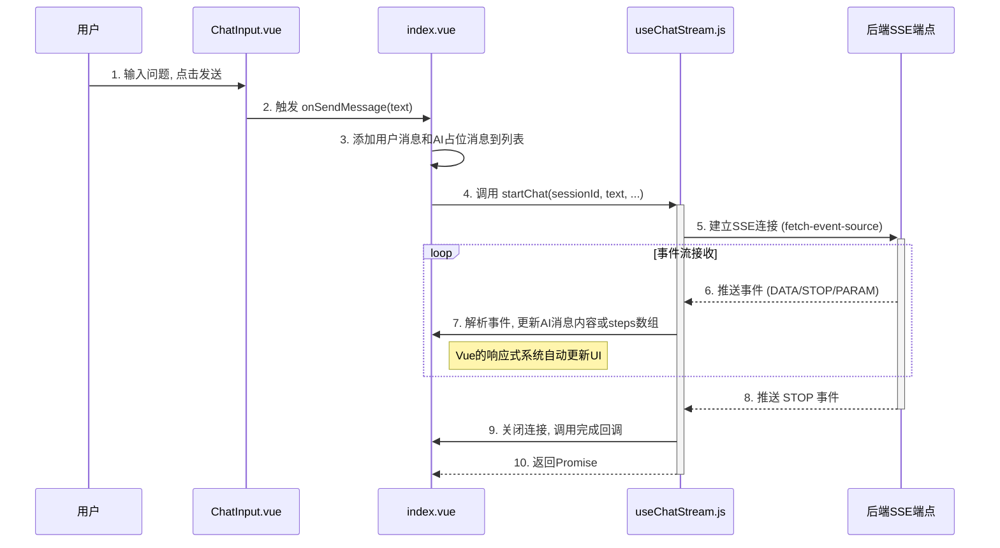

<p align="center">
	
</p>
<h1 align="center" style="margin: 30px 0 30px; font-weight: bold;">智瞳AI · 前端</h1>
<h4 align="center">一个为智瞳AI代理服务打造的，功能丰富、响应式的Web用户界面。</h4>

---

## 核心架构

智瞳AI前端是基于 `Vue 3` 的现代化单页应用（SPA），使用了 `Vite` 作为构建工具，具备高效的开发体验和性能。整个架构围绕着组件化、响应式数据流和与后端服务的实时通信来设计。

### 架构图

```mermaid
graph TD
    subgraph 浏览器 (Browser)
        A[用户交互]
    end

    subgraph Vue 应用 (Vue App)
        B(Views) -- 渲染 --> C(Components)
        A -- 触发 --> B
        B -- 调用 --> D{Router}
        B -- 读/写 --> E{Vuex Store}
        C -- 读/写 --> E
        B -- 调用 --> F[Composables]
        F -- 发送请求 --> G[API Layer]
    end

    subgraph 后端服务 (Backend)
        H[zt-ai-server]
    end

    G -- HTTP/SSE --> H

    style F fill:#cfc,stroke:#333,stroke-width:2px
    style G fill:#f9f,stroke:#333,stroke-width:2px
```

### 核心目录与职责

- **`src/`**: 应用源码根目录。
  - **`main.js`**: 应用入口文件。负责初始化Vue实例，注册插件（`Element Plus`, `Vue Router`, `Vuex`），注册Element Plus图标组件，并初始化主题设置。
  - **`App.vue`**: 根组件，包含全局样式定义，处理iOS Safari视窗兼容性问题。
  - **`assets/`**: 存放全局样式表（`base.css`, `main.css`）、字体和图片等静态资源。
  - **`router/`**: **路由模块**
    - `index.js` 定义了应用的所有路由：`/`（主聊天界面，需认证）和 `/login`（登录页）。
    - 使用 `beforeEach` 导航守卫实现了路由级别的认证，未登录用户访问受保护页面时会自动跳转到登录页。
  - **`store/`**: **状态管理**
    - `index.js`: 使用 `Vuex` 进行全局状态管理，主要包括：
      - `token`: 用户登录凭证
      - `userInfo`: 用户信息（如昵称）
      - `theme`: 当前主题设置（light/dark）
    - `sessionTypeCache.js`: 会话类型缓存模块，独立于Vuex，使用Map存储会话类型（CHAT/AGENT）。
  - **`views/`**: **视图层**
    - `Login.vue`: 登录页面，支持手机号+验证码登录，包含主题切换功能。
    - `chat/index.vue`: 核心聊天界面，整合侧边栏、消息列表和输入组件，管理会话状态和消息流。
  - **`components/`**: **组件层**
    - `chat/`: 聊天相关组件
      - `ChatSidebar.vue`: 侧边栏，显示会话列表，支持创建、选择、重命名、删除会话。
      - `ChatMessage.vue`: 消息渲染组件，根据消息类型（用户/AI）和内容（普通文本/Markdown/Agent步骤）进行不同渲染。
      - `ChatInput.vue`: 输入组件，支持普通Chat模式和Task(ReAct)模式切换。
      - `ChatBubble.vue`: 消息气泡组件，用于普通消息渲染。
      - `AgentSteps.vue`: Agent执行步骤展示组件，渲染ReAct模式的思考过程。
      - `PlanStep.vue`, `ThinkingStep.vue`, `ActionStep.vue`, `ReflectionStep.vue`: 各类步骤详情组件。
      - `SessionCard.vue`: 会话卡片组件。
    - `empty/`: 空状态组件
      - `EmptyState.vue`: 空对话界面展示。
  - **`api/`**: **API与业务逻辑层**
    - **`composables/`**: 存放了核心的组合式函数，是业务逻辑的主要载体。
      - `useChatSession.js`: 封装了所有与会话管理相关的逻辑（创建、查询、更新、删除、切换会话，获取会话详情和ReAct状态）。
      - `useChatStream.js`: **核心中的核心**。封装了与后端SSE端点进行实时通信的全部复杂性，使用 `@microsoft/fetch-event-source` 库建立连接、接收事件、处理数据，支持普通Chat模式和ReAct(Task)模式。
    - `chat.js`: 会话和聊天相关的API接口定义。
    - `user.js`: 用户认证相关API（发送验证码、登录）。
    - `content.js`: 内容相关API。
    - `request.js`: 封装了 `axios`，提供请求/响应拦截器，自动附加认证Token，处理401等错误状态。
  - **`utils/`**: 工具函数目录
    - `request.js`: Axios请求封装。

## 功能特性

### 双模式对话

- **Chat模式**: 普通对话模式，AI直接回复用户问题。
- **Task模式**: ReAct代理模式，AI会逐步展示思考过程（规划子任务→思考策略→执行行动→最终总结）。

### 主题切换

支持浅色/深色主题切换，主题偏好保存在localStorage中，页面刷新后自动恢复。

### 实时通信

通过 **Server-Sent Events (SSE)** 与后端进行实时通信，完美适配了ReAct模式下逐步返回思考和行动结果的场景。

### SSE 通信流程图



### 流程详解

1.  **发送消息**: 用户在 `ChatInput` 组件中输入问题并发送。`index.vue` 的 `onSendMessage` 方法被调用。
2.  **懒创建会话**: 如果当前没有会话ID，系统会先调用后端创建新会话，会话类型根据当前模式（Chat/Task）决定。
3.  **UI即时更新**: `onSendMessage` 首先将用户的消息添加到 `messages` 数组中，并立即添加一个空的、响应式的AI消息占位符。
4.  **启动流式请求**: 调用 `useChatStream` 中的 `startChat` 方法，根据模式向后端的 `/public/agent/chat`（Chat模式）或 `/public/agent/task`（Task模式）端点发起SSE连接。
5.  **接收与处理事件**: `startChat` 设置事件监听器处理不同类型的事件：
    - **DATA事件**: 包含实际内容数据
      - Chat模式: 直接追加到消息 `content`
      - Task模式: 根据 `stage` 字段（TASK_PLAN/STRATEGY_THINK/ACTION_RESULT/FINAL_SUMMARY）处理不同阶段数据
    - **STOP事件**: 标记对话完成
    - **PARAM事件**: 参数事件
6.  **响应式渲染**: 由于AI消息对象是响应式的，每当 `content` 或 `steps` 数组被修改时，`ChatMessage.vue` 组件都会自动重新渲染。
7.  **结束流程**: 当收到STOP事件时，连接关闭，执行完成回调（如刷新会话标题）。

### ReAct阶段说明

Task模式下，AI的执行过程分为四个阶段：

| 阶段 | stage值 | 说明 |
|------|---------|------|
| TASK_PLAN | 0 | 规划子任务，分解复杂问题 |
| STRATEGY_THINK | 1 | 思考策略，分析下一步行动 |
| ACTION_RESULT | 2 | 执行行动，展示工具调用结果 |
| FINAL_SUMMARY | 3 | 最终总结，给出完整答案 |

## 如何运行

### 环境准备

- Node.js 20+
- npm

### 安装依赖

```bash
npm install
```

### 配置后端地址

项目使用环境变量配置代理，修改 `.env.development` 文件：

```env
# 代理前缀
VITE_APP_BASE_API = '/api'

# 后端目标地址 (仅供参考，实际在 vite.config.js 配置)
VITE_APP_SERVER_URL = 'http://127.0.0.1:18081'
```

如需修改后端地址，编辑 `vite.config.js` 中的 `server.proxy.target` 配置：

```javascript
proxy: {
  [VITE_APP_BASE_API]: {
    target: 'http://127.0.0.1:18081', // 修改为你的后端地址
    changeOrigin: true,
    rewrite: (path) => path.replace(new RegExp(`^${VITE_APP_BASE_API}`), ''),
    secure: false,
    ws: true
  }
}
```

### 运行开发服务器

```bash
npm run dev
```

开发服务器将在 `http://localhost:5173` 启动，并允许局域网访问。

### 构建生产版本

```bash
npm run build
```

### 预览生产构建

```bash
npm run preview
```

## 技术栈

- **框架**: Vue 3 (Composition API)
- **构建工具**: Vite 6
- **状态管理**: Vuex 4
- **路由**: Vue Router 4
- **UI组件库**: Element Plus
- **HTTP客户端**: Axios
- **SSE客户端**: @microsoft/fetch-event-source
- **Markdown渲染**: marked + highlight.js
- **样式**: CSS Variables + Scoped CSS

## 项目结构

```
zt-ai-vue/
├── public/                 # 静态资源
├── src/
│   ├── api/               # API层
│   │   ├── composables/   # 组合式函数
│   │   ├── chat.js        # 聊天API
│   │   ├── user.js        # 用户API
│   │   └── content.js     # 内容API
│   ├── assets/            # 静态资源（样式、图片）
│   ├── components/        # 组件
│   │   ├── chat/          # 聊天相关组件
│   │   └── empty/         # 空状态组件
│   ├── router/            # 路由配置
│   ├── store/             # Vuex状态管理
│   ├── utils/             # 工具函数
│   ├── views/             # 页面视图
│   ├── App.vue            # 根组件
│   └── main.js            # 入口文件
├── .env.development       # 开发环境变量
├── vite.config.js         # Vite配置
└── package.json           # 项目配置
```
