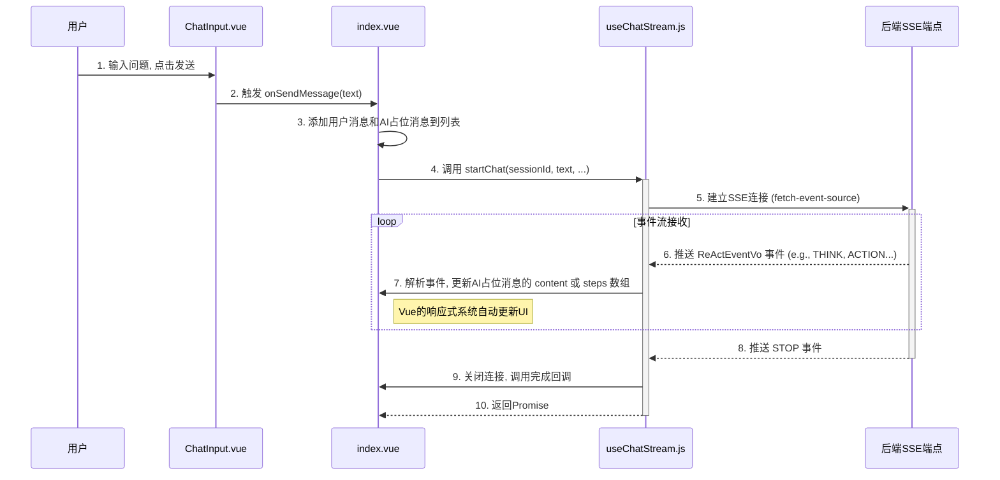

<p align="center">
	
</p>
<h1 align="center" style="margin: 30px 0 30px; font-weight: bold;">智瞳AI · 前端</h1>
<h4 align="center">一个为智瞳AI代理服务打造的，功能丰富、响应式的Web用户界面。</h4>

---

## 核心架构

智瞳AI前端是基于 `Vue 3` 的现代化单页应用（SPA），使用了 `Vite` 作为构建工具，具备高效的开发体验和性能。整个架构围绕着组件化、响应式数据流和与后端服务的实时通信来设计。

### 架构图

```mermaid
graph TD
    subgraph 浏览器 (Browser)
        A[用户交互]
    end

    subgraph Vue 应用 (Vue App)
        B(Views) -- 渲染 --> C(Components)
        A -- 触发 --> B
        B -- 调用 --> D{Router}
        B -- 读/写 --> E{Vuex Store}
        C -- 读/写 --> E
        B -- 调用 --> F[Composables]
        F -- 发送请求 --> G[API Layer]
    end

    subgraph 后端服务 (Backend)
        H[zt-ai-server]
    end

    G -- HTTP/SSE --> H

    style F fill:#cfc,stroke:#333,stroke-width:2px
    style G fill:#f9f,stroke:#333,stroke-width:2px
```

### 核心目录与职责

- **`src/`**: 应用源码根目录。
  - **`main.js`**: 应用入口文件。负责初始化Vue实例，并注册插件如 `Element Plus`, `Vue Router`, 和 `Vuex`。
  - **`App.vue`**: 根组件。
  - **`assets/`**: 存放全局样式表、字体和图片等静态资源。
  - **`router/`**: **路由模块**
    - `index.js` 定义了应用的所有路由，如 `/login` 和主聊天界面 `/`。
    - 使用 `beforeEach` 导航守卫实现了路由级别的认证，未登录用户访问受保护页面时会自动跳转到登录页。
  - **`store/`**: **状态管理**
    - 使用 `Vuex` 进行全局状态管理，主要包括用户信息、登录凭证（Token）和会话类型缓存等。
  - **`views/`**: **视图层**
    - 存放页面级别的组件。`Login.vue` 负责登录，`chat/index.vue` 是核心的聊天界面。
  - **`components/`**: **组件层**
    - 存放可复用的UI组件。`chat/` 子目录下的组件（如 `ChatSidebar`, `ChatMessage`, `ChatInput`）构成了聊天界面的主要部分。
    - `ChatMessage.vue` 是一个关键组件，它能根据消息类型（用户、AI）和内容（普通文本、Markdown、Agent执行步骤）进行不同的渲染。
  - **`api/`**: **API与业务逻辑层**
    - **`composables/`**: 存放了核心的组合式函数，是业务逻辑的主要载体。
      - `useChatSession.js`: 封装了所有与会话管理相关的逻辑（增、删、改、查、切换）。
      - `useChatStream.js`: **核心中的核心**。它封装了与后端SSE端点进行实时通信的全部复杂性。使用 `@microsoft/fetch-event-source` 库来建立连接、接收事件、处理数据，并将其更新到Vue的响应式状态中。
    - `request.js`: 封装了 `axios`，提供了请求/响应拦截器，用于统一处理API请求，如自动附加认证Token。

## 实时通信与数据流

前端通过 **Server-Sent Events (SSE)** 与后端进行实时通信，完美适配了ReAct模式下逐步返回思考和行动结果的场景。

### SSE 通信流程图



### 流程详解

1.  **发送消息**: 用户在 `ChatInput` 组件中输入问题并发送。`index.vue` 的 `onSendMessage` 方法被调用。
2.  **UI即时更新**: `onSendMessage` 首先将用户的消息添加到 `messages` 数组中，并**立即添加一个空的、响应式的AI消息占位符**。这使得UI可以马上显示用户的消息，并为即将到来的AI响应提供一个加载中的位置。
3.  **启动流式请求**: 调用 `useChatStream` 中的 `startChat` 方法。此方法使用 `@microsoft/fetch-event-source` 向后端的 `/public/agent/task` 或 `/public/agent/chat` 端点发起连接。
4.  **接收与处理事件**: `startChat` 设置了 `onmessage` 事件监听器。当后端推送 `ReActEventVo` 事件时，该监听器被触发。
    - 它会解析收到的JSON数据，判断事件的类型（`stage`）。
    - 如果是 `TASK_PLAN`, `STRATEGY_THINK`, `ACTION_RESULT` 等中间步骤，它会将数据追加到AI消息占位符的 `steps` 数组中。
    - 如果是 `FINAL_SUMMARY` 或普通聊天内容，它会将文本追加到AI消息的 `content` 属性中。
5.  **响应式渲染**: 由于AI消息对象是响应式的（通过 `reactive` 创建），每当 `content` 或 `steps` 数组被修改时，`ChatMessage.vue` 组件都会自动重新渲染，从而实时地将AI的思考过程展示给用户。
6.  **结束流程**: 当后端发送 `type: "stop"` 的事件时，`fetch-event-source` 会关闭连接。`startChat` 方法的Promise完成，并可以执行一些清理或后续操作，如刷新会话列表。

## 如何运行

1.  **环境准备**:
    - Node.js 20+
    - pnpm (推荐)
2.  **安装依赖**:
    ```bash
    pnpm install
    ```
3.  **配置后端地址**:
    - 修改 `vite.config.js` 文件中的 `server.proxy` 配置，将其指向你本地运行的 `zt-ai` 后端服务地址。
4.  **运行开发服务器**:
    ```bash
    pnpm dev
    ```
5.  **构建生产版本**:
    ```bash
    pnpm build
    ```
